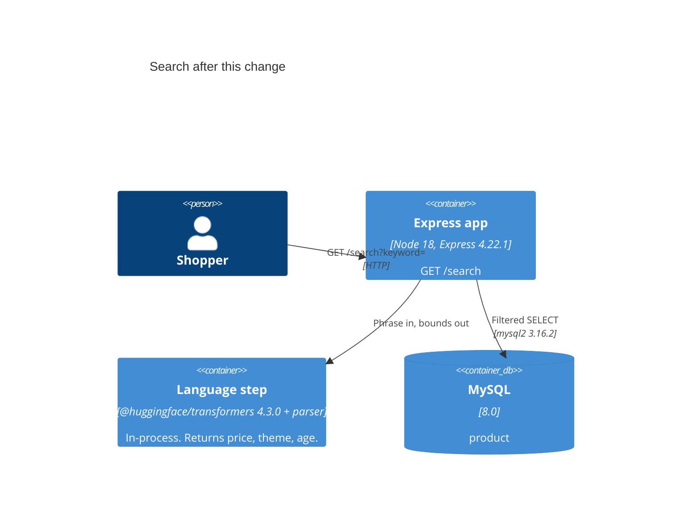

# Solution architecture

`GET /search` keeps its route. When `keyword` is empty, the handler keeps today's query. When `keyword` is present, it calls the language step, then queries MySQL with the price and theme bounds, then drops rows whose stored age does not overlap, then renders the page.

The model and the parser live in the Express process. There is no second service.

Trace: architecture baseline, FR2.1.1, ADR-0001.
