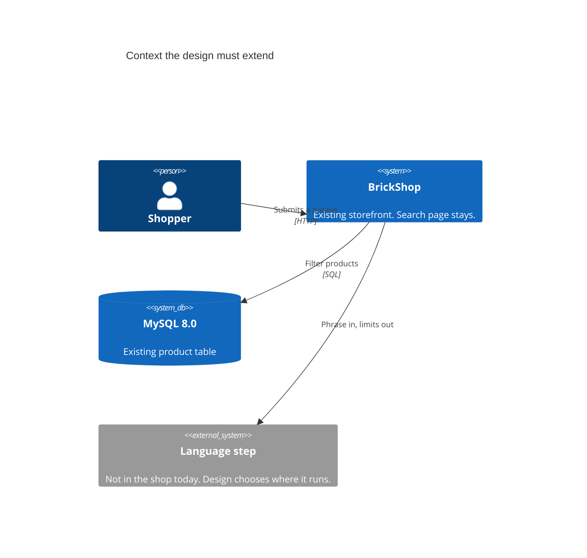
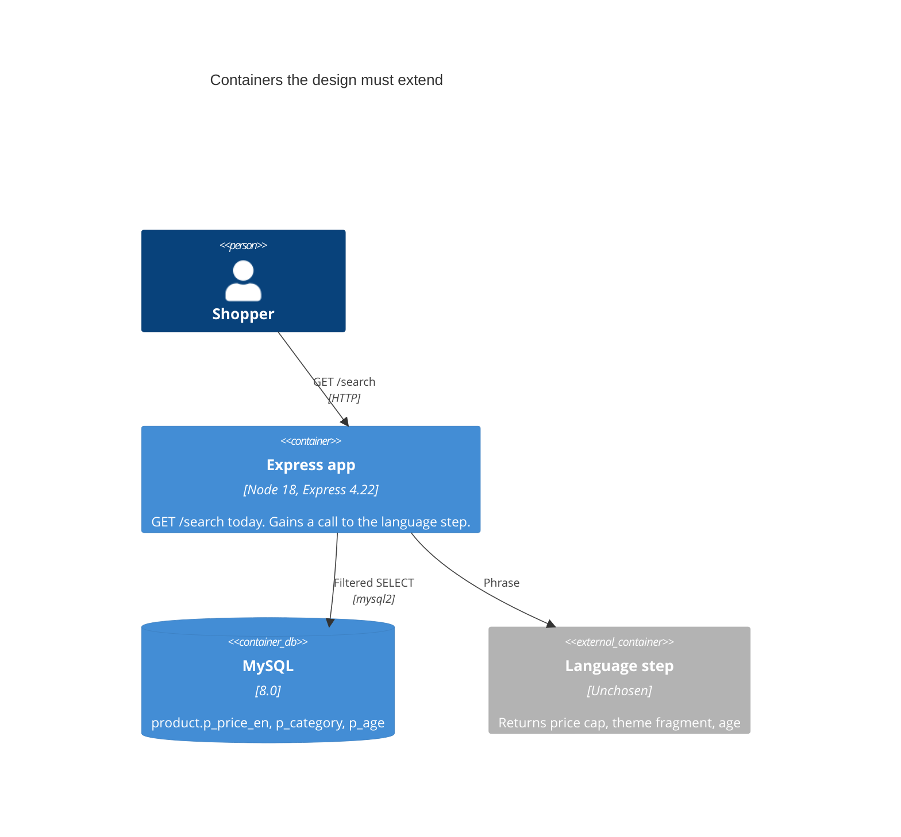

# Architecture baseline

Sole discovery input for the design of `natural-language-search`. Synthesized 2026-09-23. Requirements version 0.3.

## What exists

BrickShop is one Node 18 process. Express 4.22 renders EJS and queries MySQL 8.0 through mysql2. Catalog search is `GET /search` in `index.js`. It is public. It matches the English product name, can filter a theme exactly, sorts by the discounted English price, and pages 20 rows. Compose runs the app on port 3001 and MySQL on port 3306. There is no separate API and no model.

The product row already stores the three facts the requirements use: English list price (`p_price_en`), theme name (`p_category`), and age text (`p_age`). It does not store color.

## What this change must add

A language step that reads a submitted phrase and returns an optional price bound, an optional theme fragment, and an optional age bound. The search handler then filters `product` with those limits and renders the existing results list plus the interpreted limits. The requirements do not choose the model. They do require:

- English list price. "Under N" is `<= N`. "Over N" is `>= N`. "Between A and B" is `>= A` and `<= B`. A product at 50.00 matches both "under $50" and "over $50". A product at 50.01 does not match "under $50".
- Theme fragment, every matching theme included.
- One age falls inside the stored age text. An age range overlaps that text. Phrase "5-12" overlaps stored "6-12", and overlaps "12+" at 12.
- All yielded limits must hold.
- No yielded limit means no products and no limits to show.
- Empty search and the separate price-order and category controls stay as they are.

## Debt the design must account for

The missing language step and the text-shaped ages are must-fix for this feature. Automated tests are should-fix. The dropped keyword on the old controls, the single `index.js`, and the unused header search box are deferred because the requirements say not to change them.

## Constraints the design inherits

- On-prem, single-region. A hosted model would send the phrase off the shop (RSK-007). The requirements leave that choice to this design.
- No new tables or columns. No new screen. Search stays unsigned-in.
- Do not change checkout, cart, comments, paging, or product detail.

## C4 Level 1 — context the design extends

## C4 Level 2 — containers the design must extend

