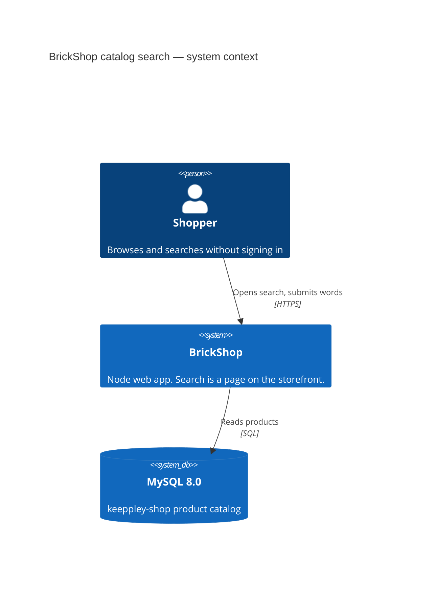
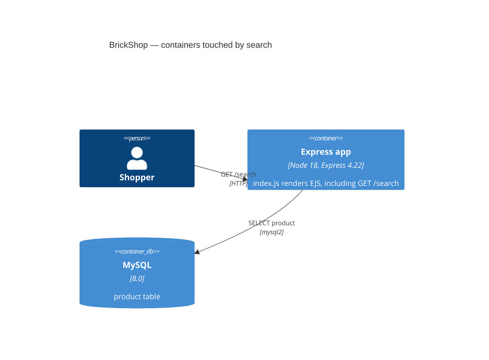

# Raw architectural observations

Scoped to natural-language search on BrickShop. Observed 2026-09-23 from the knowledge base and the repo. The verified code snapshot is `8bf0b1d3` (2 March 2026), which is still HEAD and is older than the 30-day staleness window.

## Component topology

One Node process serves the storefront and the admin dashboard. Catalog search is a route handler in `index.js` (`GET /search`) that renders `views/search.ejs`. The knowledge-base component is `storefront-catalog`. It depends on `mysql-shop-schema`. `shopping-cart` and `contact-and-comments` depend on the catalog, not on search matching.

## Framework conventions

| Piece | Observed |
|---|---|
| Runtime | `node:18-alpine` in the Dockerfile |
| HTTP | Express `^4.22.1` |
| HTML | EJS `^3.1.10`, server-rendered. No client-side router. |
| SQL | mysql2 `^3.16.2`, callbacks via `conn.query` |
| Session | express-session `^1.19.0` |
| Process entry | `index.js`. Dev start is nodemon. |

Handlers, SQL, and view names live together in `index.js`. There is no separate API service and no message bus.

## Deployment

Local Compose runs `app` and `db`. The app listens on port 3001. MySQL is `mysql:8.0` on port 3306. A monthly GitHub workflow retags a Docker Hub image. It is not an application deploy pipeline.

## Data layer

Search reads `product`. The columns this change needs are `p_price_en`, `p_category`, and `p_age`. Also present and not used by the new limits: `p_name_en`, `p_name_vn`, `p_price_vn`, `p_discount`, descriptions. There is no color column. `p_age` is text such as `12+` or `6-12`. `p_category` is a theme name such as `Lego Ninjago`.

Today's search matches `p_name_en` with a contains-match, optionally filters `p_category` exactly, sorts by discounted English price, and pages 20 rows. The category and sort form does not send the keyword.

## Integration patterns

The browser sends a GET to `/search`. The handler queries MySQL and returns HTML. No external search service, no model, no HTTP API for catalog search.

## Security boundaries

`auth_user` does not require sign-in. It sets a guest when no session user exists. Search is public. Checkout is the gated flow, and this change must not touch it.

## C4 Level 1 — system context (as-is)

## C4 Level 2 — containers (as-is)

